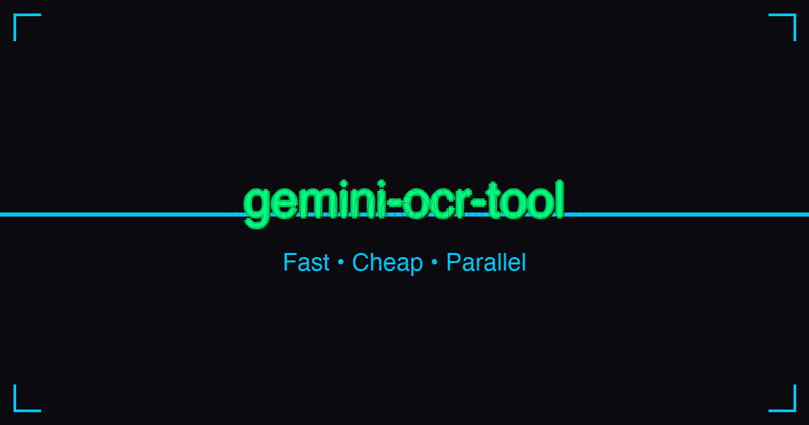

# gemini-ocr-tool

<p align="center">
  
</p>

[](https://www.python.org/downloads/)
[](https://opensource.org/licenses/MIT)
[](https://github.com/astral-sh/ruff)
[](https://github.com/python/mypy)

A CLI tool that extracts text from images and PDFs using Google Gemini 3 Flash.

## Quick Start

```bash
# Install
git clone https://github.com/dnvriend/gemini-ocr-tool.git
cd gemini-ocr-tool
uv tool install .

# Set API key (get from https://aistudio.google.com/app/apikey)
export GEMINI_API_KEY=your_api_key

# Run
gemini-ocr-tool "*.png" output.md
```

## Usage

```bash
gemini-ocr-tool [OPTIONS] GLOB_PATTERN OUTPUT_FILE

Arguments:
  GLOB_PATTERN      Pattern to match files (*.png, *.pdf, dir/*.jpg)
  OUTPUT_FILE       Path to output markdown file

Options:
  -v, --verbose     Verbosity level (-v INFO, -vv DEBUG, -vvv TRACE)
  --api-key TEXT    Gemini API key (overrides env var)
  --use-vertex      Use Vertex AI instead of Developer API
  --project TEXT    Google Cloud project ID (Vertex AI)
  --location TEXT   Google Cloud location (Vertex AI)
  --version         Show version
  --help            Show help
```

### Examples

```bash
gemini-ocr-tool "*.png" output.md          # Process PNGs
gemini-ocr-tool "docs/*.pdf" notes.md -v   # Process PDFs with logging
gemini-ocr-tool "*.jpg" out.md --use-vertex --project=my-project
```

## Authentication

**Gemini Developer API** (recommended):
```bash
export GEMINI_API_KEY=your_api_key
```

**Vertex AI** (enterprise):
```bash
export GOOGLE_GENAI_USE_VERTEXAI=true
export GOOGLE_CLOUD_PROJECT=your-project-id
export GOOGLE_CLOUD_LOCATION=us-central1
```

## Development

```bash
make install    # Install dependencies
make check      # Run lint, typecheck, test, security
make pipeline   # Full CI pipeline
```

See [references/development.md](references/development.md) for detailed development guide.

## License

MIT License - see [LICENSE](LICENSE) for details.

## Author

**Dennis Vriend** - [@dnvriend](https://github.com/dnvriend)
